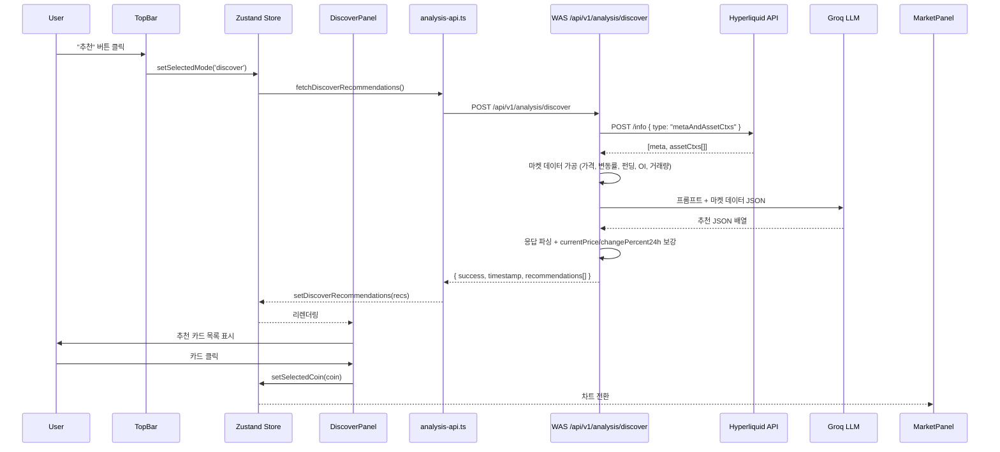

# Design Document: 코인 추천 (Coin Discover)

## Overview

Calico Terminal에 "코인 추천(Discover)" 모드를 추가한다. 기존 포지션/오더 분석과 동일한 아키텍처 패턴(WAS 오케스트레이터 → 데이터 수집 → LLM 해석 → FE 렌더링)을 따르되, 입력이 단일 코인이 아닌 Hyperliquid 전체 마켓 데이터(`metaAndAssetCtxs`)이고, 출력이 3~5개 코인 추천 카드인 점이 다르다.

핵심 흐름:
1. 사용자가 TopBar 모드 토글에서 "추천" 클릭
2. FE Store가 `selectedMode = 'discover'`로 전환, Discover API 호출
3. WAS가 Hyperliquid `metaAndAssetCtxs` 전체 마켓 데이터 수집
4. 수집된 데이터를 LLM(Groq 우선)에 전달하여 3~5개 코인 추천 JSON 생성
5. FE가 응답을 파싱하여 Discover Panel에 카드 목록 렌더링
6. 카드 클릭 시 `selectedCoin` 변경 → 차트 전환

기존 포지션/오더 분석 기능은 `selectedMode`에 따라 조건부 렌더링되므로 영향 없음.

## Architecture



### 기존 아키텍처와의 관계

| 레이어 | 기존 (Position/Order) | 신규 (Discover) |
|--------|----------------------|-----------------|
| TopBar | 모드 토글 없음 | `추천 \| 포지션 \| 오더` 3버튼 토글 추가 |
| Store | `selectedMode: 'position' \| 'order' \| null` | `'discover'` 추가 |
| 오른쪽 패널 | AICopilotPanel (탭 기반) | Discover Panel (카드 목록) |
| WAS API | `/analysis/position`, `/analysis/order` | `/analysis/discover` 추가 |
| 데이터 소스 | 단일 코인 마켓 데이터 | 전체 마켓 `metaAndAssetCtxs` |
| AI 엔진 | Rule Engine 결과 해석 | 마켓 데이터 기반 코인 추천 생성 |

## Components and Interfaces

### 1. TopBar 모드 토글 (FE)

기존 `TopBar.tsx`의 중앙 영역에 모드 토글 버튼 그룹 추가.

```typescript
// TopBar.tsx 내부 — 지갑 연결 상태에서만 표시
const MODE_OPTIONS = [
  { value: 'discover', label: '추천' },
  { value: 'position', label: '포지션' },
  { value: 'order', label: '오더' },
] as const;
```

- `isConnected === true`일 때만 렌더링
- 활성 버튼: `bg-[#58a6ff22] text-[#58a6ff]`
- 비활성 버튼: `text-[#8b949e]`
- 클릭 시 `setSelectedMode(value)` 호출

### 2. Discover Panel (FE — 신규 컴포넌트)

`DiscoverPanel.tsx` — 오른쪽 패널 영역에 렌더링. `page.tsx`의 `ConnectedLayout`에서 `selectedMode === 'discover'`일 때 `AICopilotPanel` 대신 표시.

```typescript
interface DiscoverPanelProps {}

// 내부 상태:
// - Store에서 discoverRecommendations, discoverLoading 구독
// - "새로운 추천 받기" 버튼 → fetchDiscoverRecommendations() 호출
// - 카드 클릭 → setSelectedCoin(rec.coin)
```

### 3. Discover Card (FE — DiscoverPanel 내부 컴포넌트)

```typescript
interface DiscoverCardProps {
  recommendation: DiscoverRecommendation;
  isSelected: boolean;
  onClick: () => void;
}
```

표시 요소: 코인명, 방향 배지, 현재가, 24h 변동률, TP/SL 박스, 신뢰도 배지, 추천 사유.

### 4. Store 확장 (FE)

`useStore.ts`에 추가할 상태 및 액션:

```typescript
// 타입 확장
selectedMode: 'discover' | 'position' | 'order' | null;

// 신규 상태
discoverRecommendations: DiscoverRecommendation[] | null;
discoverLoading: boolean;
discoverLastUpdated: string | null; // ISO 8601

// 신규 액션
setDiscoverRecommendations: (recs: DiscoverRecommendation[] | null) => void;
setDiscoverLoading: (loading: boolean) => void;
setDiscoverLastUpdated: (ts: string | null) => void;
fetchDiscoverRecommendations: () => Promise<void>;
```

`fetchDiscoverRecommendations`는 `discoverLoading = true` → API 호출 → 성공 시 `discoverRecommendations` + `discoverLastUpdated` 업데이트 → 실패 시 `addAlert` + `discoverRecommendations = null` → `discoverLoading = false`.

### 5. Discover API 함수 (FE)

`analysis-api.ts`에 추가:

```typescript
export function analyzeDiscover(): Promise<DiscoverResponse> {
  return post<DiscoverResponse>('/api/v1/analysis/discover', {});
}
```

### 6. WAS API 라우트

`api/index.ts`에 추가:

```typescript
router.post("/analysis/discover", async (req, res) => {
  try {
    const result = await analyzeDiscover();
    res.json(result);
  } catch (err) {
    handleError(res, err); // 기존 handleError 재사용 — timeout → 504, LLM fail → 503
  }
});
```

`handleError`에 LLM 실패 케이스 추가:
```typescript
if (message.includes("LLM") || message.includes("AI")) {
  res.status(503).json({
    success: false,
    error: { code: "LLM_UNAVAILABLE", message: "AI 분석을 수행할 수 없습니다" },
  });
}
```

### 7. WAS Orchestrator — analyzeDiscover

`orchestrator/index.ts`에 추가:

```typescript
export async function analyzeDiscover(): Promise<DiscoverResponse> {
  return withTimeout(runDiscoverAnalysis(), config.analysisTimeout, "Discover analysis");
}

async function runDiscoverAnalysis(): Promise<DiscoverResponse> {
  // 1. Hyperliquid metaAndAssetCtxs 호출
  const [meta, assetCtxs] = await fetchMetaAndAssetCtxs();

  // 2. 마켓 데이터 가공 (코인명, markPx, prevDayPx, dayNtlVlm, funding, openInterest, changePercent24h)
  const marketSummary = buildMarketSummary(meta, assetCtxs);

  // 3. LLM 호출 — 프롬프트에 marketSummary 포함
  const recommendations = await generateDiscoverRecommendations(marketSummary);

  // 4. LLM 응답에 currentPrice, changePercent24h 보강 (LLM이 반환한 coin과 매칭)
  const enriched = enrichRecommendations(recommendations, marketSummary);

  return {
    success: true,
    timestamp: new Date().toISOString(),
    recommendations: enriched,
  };
}
```

### 8. Hyperliquid Client 확장

`hyperliquid-client.ts`에 추가:

```typescript
export async function getMetaAndAssetCtxs(): Promise<[MarketMeta, AssetCtx[]]> {
  const data = await postInfo({ type: "metaAndAssetCtxs" });
  return data as [MarketMeta, AssetCtx[]];
}
```

기존 `getFundingRate`, `getOpenInterest`도 내부적으로 `metaAndAssetCtxs`를 호출하지만 단일 코인만 추출한다. Discover에서는 전체 배열을 사용한다.

### 9. AI Engine — Discover 프롬프트

`prompt-builder.ts`에 추가:

```typescript
export function buildDiscoverPrompt(marketSummary: MarketCoinSummary[]): { system: string; user: string } {
  // system: 암호화폐 단기 트레이딩 추천 전문가 역할
  // user: 전체 코인 마켓 데이터 테이블 + JSON 배열 응답 형식 지정
}
```

`ai-engine/index.ts`에 추가:

```typescript
export async function generateDiscoverRecommendations(
  marketSummary: MarketCoinSummary[]
): Promise<DiscoverRecommendation[] | null> {
  const { system, user } = buildDiscoverPrompt(marketSummary);
  const raw = await callLLM(system, user);
  if (!raw) return null;
  try {
    const parsed = JSON.parse(raw);
    return Array.isArray(parsed) ? parsed : null;
  } catch {
    return null;
  }
}
```

### 10. page.tsx ConnectedLayout 수정

```typescript
// 오른쪽 패널 조건부 렌더링
<div className="w-[320px] shrink-0 border-l border-[#30363d] overflow-y-auto">
  {selectedMode === 'discover' ? <DiscoverPanel /> : <AICopilotPanel />}
</div>
```

Discover 모드에서도 차트(MarketPanel)는 그대로 표시. 카드 클릭 시 `selectedCoin` 변경으로 차트 전환.

## Data Models

### FE 타입 (types.ts에 추가)

```typescript
export interface DiscoverRecommendation {
  coin: string;
  direction: 'LONG' | 'SHORT';
  currentPrice: number;
  changePercent24h: number;
  tp: number;
  sl: number;
  confidence: 'high' | 'medium' | 'low';
  reason: string;
}

export interface DiscoverResponse {
  success: boolean;
  timestamp: string;
  recommendations: DiscoverRecommendation[];
}
```

### WAS 타입 (types/index.ts에 추가)

```typescript
export interface AssetCtx {
  funding: string;
  openInterest: string;
  prevDayPx: string;
  dayNtlVlm: string;
  premium: string;
  oraclePx: string;
  markPx: string;
  midPx: string;
  impactPxs: string[];
}

export interface MarketCoinSummary {
  coin: string;
  markPx: number;
  prevDayPx: number;
  changePercent24h: number;
  dayNtlVlm: number;
  funding: number;
  openInterest: number;
}

export interface DiscoverRecommendation {
  coin: string;
  direction: "LONG" | "SHORT";
  currentPrice: number;
  changePercent24h: number;
  tp: number;
  sl: number;
  confidence: "high" | "medium" | "low";
  reason: string;
}

export interface DiscoverResponse {
  success: boolean;
  timestamp: string;
  recommendations: DiscoverRecommendation[];
}
```

### Hyperliquid metaAndAssetCtxs 응답 구조

```
[
  { universe: [{ name: "BTC", szDecimals: 5, maxLeverage: 50 }, ...] },
  [{ funding: "0.0001", openInterest: "1234.5", prevDayPx: "67000", dayNtlVlm: "500000000", markPx: "68100", ... }, ...]
]
```

`meta.universe[i].name`과 `assetCtxs[i]`가 인덱스로 매칭된다.

### 24시간 변동률 계산

```typescript
changePercent24h = ((markPx - prevDayPx) / prevDayPx) * 100
```

### Store 상태 변경 요약

| 필드 | 타입 | 초기값 | 설명 |
|------|------|--------|------|
| `selectedMode` | `'discover' \| 'position' \| 'order' \| null` | `null` | 기존 타입 확장 |
| `discoverRecommendations` | `DiscoverRecommendation[] \| null` | `null` | 추천 결과 |
| `discoverLoading` | `boolean` | `false` | 로딩 상태 |
| `discoverLastUpdated` | `string \| null` | `null` | 마지막 분석 시각 (ISO) |


## Correctness Properties

*A property is a characteristic or behavior that should hold true across all valid executions of a system — essentially, a formal statement about what the system should do. Properties serve as the bridge between human-readable specifications and machine-verifiable correctness guarantees.*

### Property 1: 모드 토글 상태 동기화

*For any* mode value in `['discover', 'position', 'order']`, when `setSelectedMode(mode)` is called, the store's `selectedMode` should equal that mode value, and the corresponding toggle button should have the active style class (`bg-[#58a6ff22]`).

**Validates: Requirements 1.2, 1.3**

### Property 2: Discover 카드 필수 필드 렌더링

*For any* valid `DiscoverRecommendation` object, the rendered Discover Card should contain: coin name, direction badge (LONG=green `#238636`, SHORT=red `#f85149`), currentPrice, changePercent24h, TP (green box), SL (red box), confidence badge (high=green, medium=yellow, low=red), and reason text.

**Validates: Requirements 2.2, 8.1, 8.2, 8.3**

### Property 3: 카드 선택 시 코인 전환

*For any* `DiscoverRecommendation` in the recommendations list, clicking its card should set `selectedCoin` to that recommendation's `coin` value and apply a highlight border (`border-color: #58a6ff`, `border-width: 2px`) to the clicked card only.

**Validates: Requirements 2.3, 2.4**

### Property 4: 타임스탬프 KST 포맷팅

*For any* valid ISO 8601 timestamp string, the formatted display string should match the pattern `마지막 분석: HH:MM:SS KST` where HH, MM, SS are the KST (UTC+9) time components.

**Validates: Requirements 2.6**

### Property 5: 마켓 데이터 추출 및 변동률 계산

*For any* valid `metaAndAssetCtxs` response pair `[meta, assetCtxs]`, for each index `i`, the extracted `MarketCoinSummary` should have `coin === meta.universe[i].name`, `markPx === parseFloat(assetCtxs[i].markPx)`, and `changePercent24h === ((markPx - prevDayPx) / prevDayPx) * 100`.

**Validates: Requirements 4.2, 4.3**

### Property 6: API 응답 구조 유효성

*For any* successful Discover API response, the response should have `success === true`, a valid ISO 8601 `timestamp`, and `recommendations` as an array where each element contains `coin` (string), `direction` ("LONG" | "SHORT"), `currentPrice` (number), `changePercent24h` (number), `tp` (number), `sl` (number), `confidence` ("high" | "medium" | "low"), and `reason` (string).

**Validates: Requirements 3.2, 3.3**

### Property 7: 유효하지 않은 LLM 응답 처리

*For any* string that is not a valid JSON array, the recommendation parser should return `null` without throwing an exception.

**Validates: Requirements 5.5**

### Property 8: Store 로딩 상태 관리

*For any* Discover API fetch cycle, `discoverLoading` should be `true` while the request is in-flight and `false` after completion (success or failure). On success, `discoverRecommendations` should equal the response's `recommendations` array. On failure, `discoverRecommendations` should be `null` and an error alert should be added.

**Validates: Requirements 6.2, 6.4, 6.5**

### Property 9: Recommendation 라운드트립

*For any* valid `DiscoverRecommendation` object, serializing it to JSON and deserializing back should produce an object deeply equal to the original.

**Validates: Requirements 8.5**

## Error Handling

### WAS 에러 처리

| 에러 상황 | HTTP 코드 | 에러 코드 | 메시지 |
|-----------|-----------|-----------|--------|
| 분석 타임아웃 (10초 초과) | 504 | `ANALYSIS_TIMEOUT` | 분석 타임아웃 |
| LLM 전체 실패 (Groq+Gemini+OpenAI) | 503 | `LLM_UNAVAILABLE` | AI 분석을 수행할 수 없습니다 |
| Hyperliquid API 실패 | 503 | `MARKET_DATA_UNAVAILABLE` | 마켓 데이터를 조회할 수 없습니다 |
| LLM 응답 파싱 실패 | 503 | `LLM_UNAVAILABLE` | AI 분석을 수행할 수 없습니다 |
| 내부 오류 | 500 | `INTERNAL_ERROR` | 내부 처리 오류가 발생했습니다 |

기존 `handleError` 함수를 확장하여 LLM 실패 케이스를 추가한다. 타임아웃과 마켓 데이터 실패는 이미 처리되어 있다.

### FE 에러 처리

- API 호출 실패 시 `addAlert({ type: 'error', message: '추천 분석 실패: ...' })` 추가
- `discoverRecommendations = null` 설정 → 빈 상태 메시지 표시
- 네트워크 타임아웃(10초) 시 AbortController로 요청 취소 (기존 `analysis-api.ts` 패턴 재사용)

### Graceful Degradation

- LLM 실패 시 WAS는 503 반환, FE는 에러 알림 + 빈 상태 표시
- Hyperliquid API 실패 시 Redis 캐시 fallback (기존 `market-data-service.ts` 패턴)
- 캐시도 없으면 503 반환

## Testing Strategy

### 단위 테스트 (Unit Tests)

FE:
- DiscoverPanel: 로딩 스켈레톤 표시, 빈 상태 메시지 표시, 카드 렌더링
- DiscoverCard: 방향 배지 색상, 신뢰도 배지 색상/텍스트, TP/SL 포맷팅
- TopBar 모드 토글: 3버튼 렌더링, 활성 스타일, 지갑 미연결 시 숨김
- Store: `fetchDiscoverRecommendations` 성공/실패 시 상태 변경

WAS:
- `buildMarketSummary`: metaAndAssetCtxs → MarketCoinSummary[] 변환
- `buildDiscoverPrompt`: 프롬프트에 마켓 데이터 포함 여부
- `generateDiscoverRecommendations`: 유효/무효 JSON 파싱
- API 라우트: 성공 응답 구조, 타임아웃 504, LLM 실패 503

### 프로퍼티 기반 테스트 (Property-Based Tests)

사용자 요청에 따라 MVP 속도 우선으로 PBT는 스킵한다. 위 Correctness Properties는 향후 PBT 도입 시 테스트 명세로 활용한다.

### 통합 테스트

- FE → WAS → Hyperliquid mock: 전체 Discover 플로우 E2E
- 모드 전환 시 기존 포지션/오더 분석 기능 정상 동작 확인
