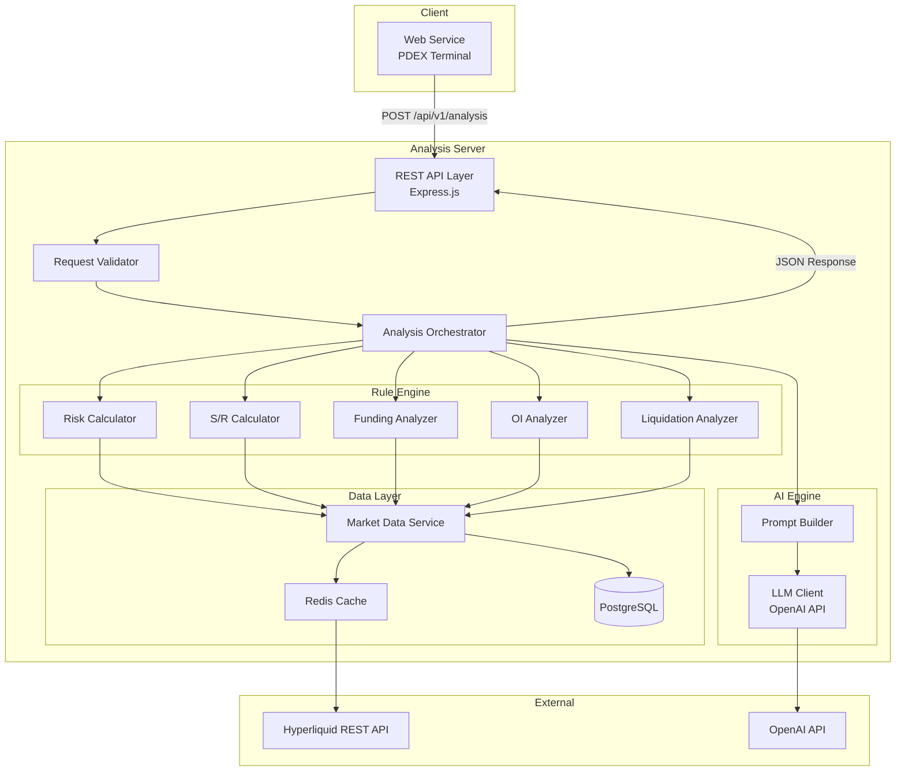
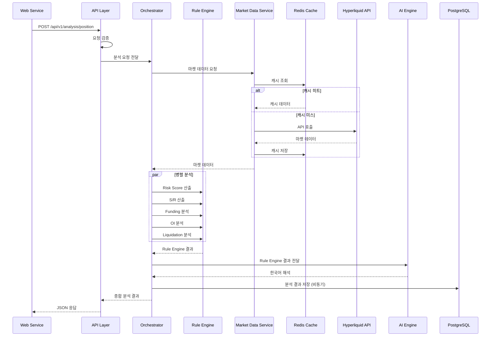

# PDEX Analysis Server 설계 문서

## Overview

PDEX Analysis Server는 사용자의 Open Position 데이터와 마켓 데이터를 기반으로 종합 분석을 수행하는 Node.js + TypeScript 백엔드 서비스이다.

핵심 설계 원칙:
- **Rule Engine / AI Engine 분리**: 수치 계산(Rule Engine)과 자연어 해석(AI Engine)을 독립 모듈로 구현
- **캐싱 우선**: Hyperliquid API 데이터를 Redis에 캐싱하여 응답 속도 확보
- **Graceful Degradation**: AI Engine 실패 시 Rule Engine 결과만 반환, Hyperliquid API 실패 시 캐시 데이터 사용

분석 범위 (Open Position 한정):
1. Risk Score 분석 (5가지 요소 합산, 1~10 척도)
2. Support/Resistance 산출 (7d/30d High-Low, VWAP, Pivot)
3. Funding Rate 분석 (추세, Z-Score, Extreme Signal)
4. Open Interest 분석 (가격-OI 시나리오, OI Spike)
5. Liquidation Cluster 분석 (롱/숏 청산 클러스터, 근접 경고)

## Architecture

### 시스템 아키텍처 다이어그램



### 요청 처리 흐름




## Components and Interfaces

### 1. REST API Layer (`src/api/`)

Express.js 기반 라우터. 요청 검증, 에러 핸들링, 응답 포맷팅을 담당한다.

| 엔드포인트 | Method | 설명 |
|-----------|--------|------|
| `POST /api/v1/analysis/position` | POST | 포지션 종합 분석 (Risk + S/R + Funding + OI + Liquidation) |
| `POST /api/v1/analysis/funding` | POST | 펀딩 레이트 단독 분석 |
| `POST /api/v1/analysis/oi` | POST | Open Interest 단독 분석 |
| `POST /api/v1/analysis/liquidation` | POST | Liquidation Cluster 단독 분석 |
| `GET /api/v1/health` | GET | 서버 상태 확인 |

### 2. Request Validator (`src/validators/`)

Zod 스키마 기반 요청 본문 검증. 유효하지 않은 요청에 대해 HTTP 400 + 상세 오류 메시지 반환.

```typescript
interface PositionAnalysisRequest {
  positions: OpenPosition[];
  symbol: string;
}

interface OpenPosition {
  coin: string;           // e.g. "BTC"
  side: "long" | "short";
  entryPrice: number;
  size: number;
  leverage: number;
  liquidationPrice: number;
  marginUsed: number;
}
```

### 3. Analysis Orchestrator (`src/orchestrator/`)

분석 파이프라인을 조율하는 중앙 컴포넌트. Rule Engine 모듈들을 병렬 실행하고, 결과를 AI Engine에 전달한다.

책임:
- Rule Engine 모듈 병렬 호출 (`Promise.all`)
- AI Engine 호출 및 실패 시 fallback 처리
- 분석 결과 조합 및 반환
- PostgreSQL 비동기 저장 트리거

### 4. Rule Engine (`src/rule-engine/`)

수치 계산 전용 모듈. 외부 의존성 없이 순수 함수로 구현한다.

#### 4.1 Risk Calculator (`risk-calculator.ts`)

```typescript
interface RiskScoreResult {
  totalScore: number;        // 1~10
  leverageRisk: number;      // 0~2
  liquidationRisk: number;   // 0~2
  volatilityRisk: number;    // 0~2
  fundingCrowdRisk: number;  // 0~2
  concentrationRisk: number; // 0~2
}

function calculateRiskScore(
  position: OpenPosition,
  allPositions: OpenPosition[],
  marketData: MarketData
): RiskScoreResult;
```

점수 산출 로직:
- **Leverage Risk**: `leverage <= 3 → 0`, `<= 10 → 1`, `> 10 → 2`
- **Liquidation Risk**: `distance > 20% → 0`, `> 10% → 1`, `<= 10% → 2`
- **Volatility Risk**: `volatility * leverage` 기반 구간 매핑
- **Funding Crowd Risk**: 펀딩 방향과 포지션 방향 일치 시 가중
- **Concentration Risk**: `positionMargin / totalMargin` 비율 기반

#### 4.2 S/R Calculator (`sr-calculator.ts`)

```typescript
interface SupportResistanceResult {
  shortTermHigh: number;   // 7일 고가
  shortTermLow: number;    // 7일 저가
  midTermHigh: number;     // 30일 고가
  midTermLow: number;      // 30일 저가
  vwap: number;            // VWAP
  pivotPoint: number;      // Pivot Point
  pivotR1: number;         // Resistance 1
  pivotS1: number;         // Support 1
}

function calculateSupportResistance(
  candles7d: CandleData[],
  candles30d: CandleData[],
  recentCandles: CandleData[]
): SupportResistanceResult;
```

#### 4.3 Funding Analyzer (`funding-analyzer.ts`)

```typescript
interface FundingAnalysisResult {
  currentRate: number;
  trend1h: "rising" | "falling" | "stable";
  trend4h: "rising" | "falling" | "stable";
  trend24h: "rising" | "falling" | "stable";
  zScore: number;
  meanReversionProbability: "높음" | "보통" | "낮음";
  extremeSignal: string | null;  // "극단 펀딩: 롱 과밀" | "극단 펀딩: 숏 과밀" | null
}

function analyzeFunding(
  currentRate: number,
  rateHistory30d: number[],
  rateHistory1h: number[],
  rateHistory4h: number[],
  rateHistory24h: number[]
): FundingAnalysisResult;
```

#### 4.4 OI Analyzer (`oi-analyzer.ts`)

```typescript
interface OIAnalysisResult {
  currentOI: number;
  oiChangePercent: number;
  priceChangePercent: number;
  scenario: "신규 롱 진입, 추세 강화" | "숏 청산, 추세 약화" | "신규 숏 진입, 하락 추세 강화" | "롱 청산, 하락 추세 약화";
  isSpike: boolean;
}

function analyzeOI(
  currentOI: number,
  previousOI: number,
  currentPrice: number,
  previousPrice: number,
  spikeThreshold?: number  // 기본값 0.05 (5%)
): OIAnalysisResult;
```

#### 4.5 Liquidation Analyzer (`liquidation-analyzer.ts`)

```typescript
interface LiquidationClusterResult {
  longClusters: PriceCluster[];
  shortClusters: PriceCluster[];
  nearbyWarning: boolean;       // 현재 가격 ±2% 이내 클러스터 존재 여부
  nearbyClusterSide: "long" | "short" | "both" | null;
}

interface PriceCluster {
  priceLevel: number;
  estimatedVolume: number;
  distancePercent: number;  // 현재 가격 대비 거리 %
}

function analyzeLiquidationClusters(
  currentPrice: number,
  marketData: MarketData,
  warningThreshold?: number  // 기본값 0.02 (2%)
): LiquidationClusterResult;
```

### 5. AI Engine (`src/ai-engine/`)

LLM API를 호출하여 Rule Engine 결과를 한국어로 해석한다.

```typescript
interface AIInterpretation {
  riskInterpretation: string;       // Risk Score 해석
  srInterpretation: string;         // S/R 해석
  fundingInterpretation: string;    // Funding 해석
  oiInterpretation: string;         // OI 해석
  liquidationInterpretation: string; // Liquidation 해석
  overallSummary: string;           // 종합 요약
}

interface AIEngine {
  interpret(ruleResults: RuleEngineResults): Promise<AIInterpretation>;
}
```

구성:
- **Prompt Builder**: Rule Engine 결과를 LLM 프롬프트로 변환
- **LLM Client**: OpenAI API 호출 (모델: gpt-4o-mini 기본, 설정 가능)
- **Fallback**: LLM 호출 실패 시 `null` 반환 → Orchestrator가 Rule Engine 결과만 포함

### 6. Market Data Service (`src/data/`)

Hyperliquid API 호출 + Redis 캐싱 + PostgreSQL 히스토리 저장을 담당한다.

```typescript
interface MarketDataService {
  getPrice(symbol: string): Promise<number>;
  getCandles(symbol: string, interval: string, days: number): Promise<CandleData[]>;
  getFundingRate(symbol: string): Promise<number>;
  getFundingHistory(symbol: string, days: number): Promise<FundingRateEntry[]>;
  getOpenInterest(symbol: string): Promise<OIData>;
  getMarketMeta(): Promise<MarketMeta>;
}
```

캐싱 전략:

| 데이터 | TTL | 설명 |
|--------|-----|------|
| 현재 가격 | 5초 | 실시간성 중요 |
| 캔들 데이터 | 60초 | 분석 주기 고려 |
| 펀딩 레이트 | 30초 | 8시간 주기 정산이나 변동 반영 |
| Open Interest | 30초 | 변동 감지 필요 |
| 마켓 메타 | 300초 | 변경 빈도 낮음 |


## Data Models

### 요청/응답 모델

#### 분석 요청 (PositionAnalysisRequest)

```typescript
interface PositionAnalysisRequest {
  positions: OpenPosition[];
  symbol: string;  // 분석 대상 코인 심볼 (e.g. "BTC")
}

interface OpenPosition {
  coin: string;
  side: "long" | "short";
  entryPrice: number;
  size: number;
  leverage: number;
  liquidationPrice: number;
  marginUsed: number;
}
```

#### 종합 분석 응답 (PositionAnalysisResponse)

```typescript
interface PositionAnalysisResponse {
  success: boolean;
  timestamp: string;  // ISO 8601
  symbol: string;
  dataFreshness: {
    source: "live" | "cached";
    cachedAt?: string;  // 캐시 데이터 사용 시 시점
  };
  ruleEngine: {
    riskScore: RiskScoreResult;
    supportResistance: SupportResistanceResult;
    funding: FundingAnalysisResult;
    openInterest: OIAnalysisResult;
    liquidation: LiquidationClusterResult;
  };
  aiInterpretation: AIInterpretation | null;  // AI 실패 시 null
}
```

#### 펀딩 분석 요청/응답

```typescript
interface FundingAnalysisRequest {
  symbol: string;
}

interface FundingAnalysisResponse {
  success: boolean;
  timestamp: string;
  symbol: string;
  dataFreshness: {
    source: "live" | "cached";
    cachedAt?: string;
  };
  ruleEngine: FundingAnalysisResult;
  aiInterpretation: { fundingInterpretation: string } | null;
}
```

#### OI 분석 요청/응답

```typescript
interface OIAnalysisRequest {
  symbol: string;
}

interface OIAnalysisResponse {
  success: boolean;
  timestamp: string;
  symbol: string;
  dataFreshness: {
    source: "live" | "cached";
    cachedAt?: string;
  };
  ruleEngine: OIAnalysisResult;
  aiInterpretation: { oiInterpretation: string } | null;
}
```

#### Liquidation 분석 요청/응답

```typescript
interface LiquidationAnalysisRequest {
  symbol: string;
}

interface LiquidationAnalysisResponse {
  success: boolean;
  timestamp: string;
  symbol: string;
  dataFreshness: {
    source: "live" | "cached";
    cachedAt?: string;
  };
  ruleEngine: LiquidationClusterResult;
  aiInterpretation: { liquidationInterpretation: string } | null;
}
```

#### 에러 응답

```typescript
interface ErrorResponse {
  success: false;
  error: {
    code: string;        // e.g. "VALIDATION_ERROR", "INTERNAL_ERROR", "MARKET_DATA_UNAVAILABLE"
    message: string;     // 사람이 읽을 수 있는 오류 메시지
    details?: unknown;   // 검증 오류 시 필드별 상세
  };
}
```

### 마켓 데이터 모델

```typescript
interface CandleData {
  timestamp: number;
  open: number;
  high: number;
  low: number;
  close: number;
  volume: number;
}

interface FundingRateEntry {
  timestamp: number;
  rate: number;
  coin: string;
}

interface OIData {
  coin: string;
  openInterest: number;
  timestamp: number;
}

interface MarketMeta {
  universe: Array<{
    name: string;
    szDecimals: number;
    maxLeverage: number;
  }>;
}
```

### PostgreSQL 스키마

```sql
-- 분석 결과 히스토리
CREATE TABLE analysis_history (
  id SERIAL PRIMARY KEY,
  symbol VARCHAR(20) NOT NULL,
  analysis_type VARCHAR(50) NOT NULL,  -- 'position', 'funding', 'oi', 'liquidation'
  rule_engine_result JSONB NOT NULL,
  ai_interpretation TEXT,
  created_at TIMESTAMP WITH TIME ZONE DEFAULT NOW()
);

CREATE INDEX idx_analysis_history_symbol_time ON analysis_history(symbol, created_at DESC);

-- 펀딩 레이트 히스토리
CREATE TABLE funding_rate_history (
  id SERIAL PRIMARY KEY,
  coin VARCHAR(20) NOT NULL,
  rate DECIMAL(18, 10) NOT NULL,
  recorded_at TIMESTAMP WITH TIME ZONE NOT NULL,
  created_at TIMESTAMP WITH TIME ZONE DEFAULT NOW()
);

CREATE INDEX idx_funding_history_coin_time ON funding_rate_history(coin, recorded_at DESC);

-- Open Interest 히스토리
CREATE TABLE oi_history (
  id SERIAL PRIMARY KEY,
  coin VARCHAR(20) NOT NULL,
  open_interest DECIMAL(30, 8) NOT NULL,
  price DECIMAL(30, 8) NOT NULL,
  recorded_at TIMESTAMP WITH TIME ZONE NOT NULL,
  created_at TIMESTAMP WITH TIME ZONE DEFAULT NOW()
);

CREATE INDEX idx_oi_history_coin_time ON oi_history(coin, recorded_at DESC);
```

### Redis 캐시 키 구조

```
pdex:price:{symbol}           → JSON (현재 가격, TTL: 5s)
pdex:candles:{symbol}:{interval}:{days} → JSON (캔들 배열, TTL: 60s)
pdex:funding:{symbol}         → JSON (현재 펀딩 레이트, TTL: 30s)
pdex:oi:{symbol}              → JSON (OI 데이터, TTL: 30s)
pdex:meta                     → JSON (마켓 메타, TTL: 300s)
```


## Correctness Properties

*속성(Property)은 시스템의 모든 유효한 실행에서 참이어야 하는 특성 또는 동작이다. 속성은 사람이 읽을 수 있는 명세와 기계가 검증할 수 있는 정확성 보장 사이의 다리 역할을 한다.*

### Property 1: Risk Score 불변 — 요소 범위 및 합산

*For any* 유효한 OpenPosition과 MarketData에 대해, calculateRiskScore가 반환하는 5가지 개별 요소(leverageRisk, liquidationRisk, volatilityRisk, fundingCrowdRisk, concentrationRisk)는 각각 0~2 범위이며, totalScore는 이 5가지 요소의 합산을 1~10 범위로 매핑한 값이어야 한다.

**Validates: Requirements 2.1, 2.2, 2.3, 2.4, 2.5, 2.6, 2.7**

### Property 2: S/R High/Low 정확성

*For any* 캔들 데이터 배열에 대해, calculateSupportResistance가 반환하는 shortTermHigh/shortTermLow는 7일 캔들의 실제 최고가/최저가와 일치하고, midTermHigh/midTermLow는 30일 캔들의 실제 최고가/최저가와 일치해야 한다.

**Validates: Requirements 3.1, 3.2, 3.3**

### Property 3: VWAP 계산 정확성

*For any* 비어있지 않은 캔들 데이터 배열에 대해, calculateSupportResistance가 반환하는 vwap는 sum(typicalPrice × volume) / sum(volume)과 동일해야 한다 (typicalPrice = (high + low + close) / 3).

**Validates: Requirements 3.4**

### Property 4: Pivot Level 계산 정확성

*For any* 전일 고가(H), 저가(L), 종가(C)에 대해, pivotPoint = (H + L + C) / 3이고, pivotR1 = 2 × pivotPoint - L이고, pivotS1 = 2 × pivotPoint - H이어야 한다.

**Validates: Requirements 3.5**

### Property 5: Funding 추세 판별 정확성

*For any* 펀딩 레이트 히스토리 배열에 대해, analyzeFunding이 반환하는 trend1h/trend4h/trend24h는 해당 구간의 시작 값과 끝 값의 관계에 따라 올바르게 "rising"/"falling"/"stable"로 판별되어야 한다.

**Validates: Requirements 4.1, 4.2**

### Property 6: Z-Score 계산 정확성

*For any* 현재 펀딩 레이트와 30일 히스토리 배열에 대해, analyzeFunding이 반환하는 zScore는 (currentRate - mean(history)) / stddev(history)와 동일해야 한다.

**Validates: Requirements 4.3**

### Property 7: Extreme Signal 판별 정확성

*For any* 펀딩 레이트에 대해, rate >= 0.001이면 extremeSignal은 "극단 펀딩: 롱 과밀"이고, rate <= -0.001이면 "극단 펀딩: 숏 과밀"이고, 그 외에는 null이어야 한다.

**Validates: Requirements 4.5, 4.6**

### Property 8: Mean Reversion 판별 정확성

*For any* 펀딩 분석 결과에 대해, zScore >= 2 또는 zScore <= -2이면 meanReversionProbability는 "높음"이어야 한다.

**Validates: Requirements 4.4**

### Property 9: OI 시나리오 판별 정확성

*For any* 가격 변화(priceChange)와 OI 변화(oiChange)에 대해, analyzeOI가 반환하는 scenario는 다음 매핑과 일치해야 한다: (price↑, OI↑) → "신규 롱 진입, 추세 강화", (price↑, OI↓) → "숏 청산, 추세 약화", (price↓, OI↑) → "신규 숏 진입, 하락 추세 강화", (price↓, OI↓) → "롱 청산, 하락 추세 약화".

**Validates: Requirements 5.2, 5.3, 5.4, 5.5**

### Property 10: OI Spike 감지 정확성

*For any* 이전 OI와 현재 OI에 대해, |currentOI - previousOI| / previousOI >= 0.05이면 isSpike는 true이고, 그렇지 않으면 false이어야 한다.

**Validates: Requirements 5.6**

### Property 11: Liquidation 클러스터 근접 경고 정확성

*For any* 현재 가격과 클러스터 가격에 대해, 클러스터가 현재 가격의 ±2% 이내에 위치하면 nearbyWarning은 true이어야 한다.

**Validates: Requirements 6.5**

### Property 12: 유효하지 않은 요청 거부

*For any* 유효하지 않은 요청 본문(필수 필드 누락, 잘못된 타입, 범위 초과 등)에 대해, API는 HTTP 400 상태 코드와 error 필드를 포함한 JSON 응답을 반환해야 한다.

**Validates: Requirements 8.2, 8.3**

### Property 13: 분석 요청 라운드트립

*For any* 유효한 분석 요청 데이터 모델에 대해, serialize(parse(json))을 다시 parse하면 원본 데이터 모델과 동일해야 한다.

**Validates: Requirements 9.1, 9.3**

### Property 14: 분석 응답 라운드트립

*For any* 유효한 분석 응답 데이터 모델에 대해, parse(serialize(model))을 다시 serialize하면 원본 JSON 문자열과 동일해야 한다.

**Validates: Requirements 9.2, 9.4**

### Property 15: AI 실패 시 Graceful Degradation

*For any* 분석 요청에 대해, AI Engine이 실패하더라도 응답의 ruleEngine 필드는 항상 존재하고 유효한 분석 결과를 포함해야 하며, aiInterpretation은 null이어야 한다.

**Validates: Requirements 1.4, 1.5**

### Property 16: 캐시 Fallback 시 데이터 시점 명시

*For any* Hyperliquid API 실패 + 캐시 존재 상황에서, 응답의 dataFreshness.source는 "cached"이고 dataFreshness.cachedAt은 null이 아닌 ISO 8601 타임스탬프여야 한다.

**Validates: Requirements 7.4**

### Property 17: DB 실패 시 분석 계속 수행

*For any* 분석 요청에 대해, PostgreSQL 연결이 실패하더라도 분석 응답은 정상적으로 반환되어야 한다 (success: true, ruleEngine 필드 존재).

**Validates: Requirements 10.5**


## Error Handling

### 에러 분류 및 처리 전략

| 에러 유형 | HTTP 코드 | 처리 전략 |
|-----------|-----------|-----------|
| 요청 검증 실패 | 400 | Zod 검증 오류 상세 반환 |
| AI Engine 실패 | 200 | Rule Engine 결과만 반환, aiInterpretation: null |
| Hyperliquid API 실패 (캐시 있음) | 200 | 캐시 데이터 사용, dataFreshness.source: "cached" |
| Hyperliquid API 실패 (캐시 없음) | 503 | MARKET_DATA_UNAVAILABLE 에러 |
| PostgreSQL 실패 | 200 | 분석 계속, 저장 실패 로그 기록 |
| 내부 오류 | 500 | INTERNAL_ERROR 에러 메시지 |
| 타임아웃 (10초 초과) | 504 | ANALYSIS_TIMEOUT 에러 |

### Graceful Degradation 우선순위

1. **최우선**: Rule Engine 결과는 항상 반환 (마켓 데이터만 있으면 가능)
2. **차선**: AI 해석은 선택적 (실패 시 null)
3. **차선**: 히스토리 저장은 비동기 (실패해도 응답에 영향 없음)
4. **최후**: 마켓 데이터 없으면 분석 불가 → 에러 반환

### 에러 응답 형식

모든 에러 응답은 동일한 구조를 따른다:

```json
{
  "success": false,
  "error": {
    "code": "VALIDATION_ERROR",
    "message": "요청 본문이 유효하지 않습니다",
    "details": {
      "positions": "최소 1개의 포지션이 필요합니다",
      "symbol": "심볼은 필수 항목입니다"
    }
  }
}
```

에러 코드 목록:
- `VALIDATION_ERROR`: 요청 검증 실패
- `MARKET_DATA_UNAVAILABLE`: 마켓 데이터 조회 불가
- `INTERNAL_ERROR`: 내부 처리 오류
- `ANALYSIS_TIMEOUT`: 분석 타임아웃

## Testing Strategy

### 테스트 프레임워크

- **단위 테스트**: Vitest
- **Property-Based Testing**: fast-check (최소 100회 반복)
- **통합 테스트**: Vitest + Supertest (API 엔드포인트)

### Property-Based Testing 설정

각 Correctness Property는 fast-check를 사용한 단일 property-based 테스트로 구현한다.

설정:
- 최소 반복 횟수: 100회
- 각 테스트에 설계 문서 속성 참조 태그 포함
- 태그 형식: `Feature: pdex-analysis-server, Property {number}: {property_text}`

### 테스트 범위

#### Property-Based Tests (fast-check)

| 테스트 | 대상 모듈 | 설계 속성 |
|--------|-----------|-----------|
| Risk Score 불변 | risk-calculator | Property 1 |
| S/R High/Low 정확성 | sr-calculator | Property 2 |
| VWAP 계산 정확성 | sr-calculator | Property 3 |
| Pivot Level 계산 정확성 | sr-calculator | Property 4 |
| Funding 추세 판별 | funding-analyzer | Property 5 |
| Z-Score 계산 정확성 | funding-analyzer | Property 6 |
| Extreme Signal 판별 | funding-analyzer | Property 7 |
| Mean Reversion 판별 | funding-analyzer | Property 8 |
| OI 시나리오 판별 | oi-analyzer | Property 9 |
| OI Spike 감지 | oi-analyzer | Property 10 |
| Liquidation 근접 경고 | liquidation-analyzer | Property 11 |
| 요청 검증 거부 | validators | Property 12 |
| 요청 라운드트립 | serializers | Property 13 |
| 응답 라운드트립 | serializers | Property 14 |
| AI 실패 Graceful Degradation | orchestrator | Property 15 |
| 캐시 Fallback 데이터 시점 | market-data-service | Property 16 |
| DB 실패 분석 계속 | orchestrator | Property 17 |

#### Unit Tests (Vitest)

- 각 Risk 요소의 경계값 테스트 (0, 1, 2 전환 지점)
- Funding Rate 극단값 경계 (±0.1% 정확히)
- OI Spike 임계값 경계 (정확히 5%)
- Liquidation 근접 경고 경계 (정확히 ±2%)
- 빈 포지션 배열 처리
- 단일 포지션 concentration risk (100%)
- Z-Score 표준편차 0인 경우 처리

#### Integration Tests (Vitest + Supertest)

- API 엔드포인트 정상 요청/응답 흐름
- Redis 캐시 히트/미스 시나리오
- PostgreSQL 저장 성공/실패 시나리오
- Hyperliquid API mock을 통한 데이터 조회 흐름
- AI Engine mock을 통한 해석 생성 흐름
- 전체 분석 파이프라인 end-to-end 테스트

